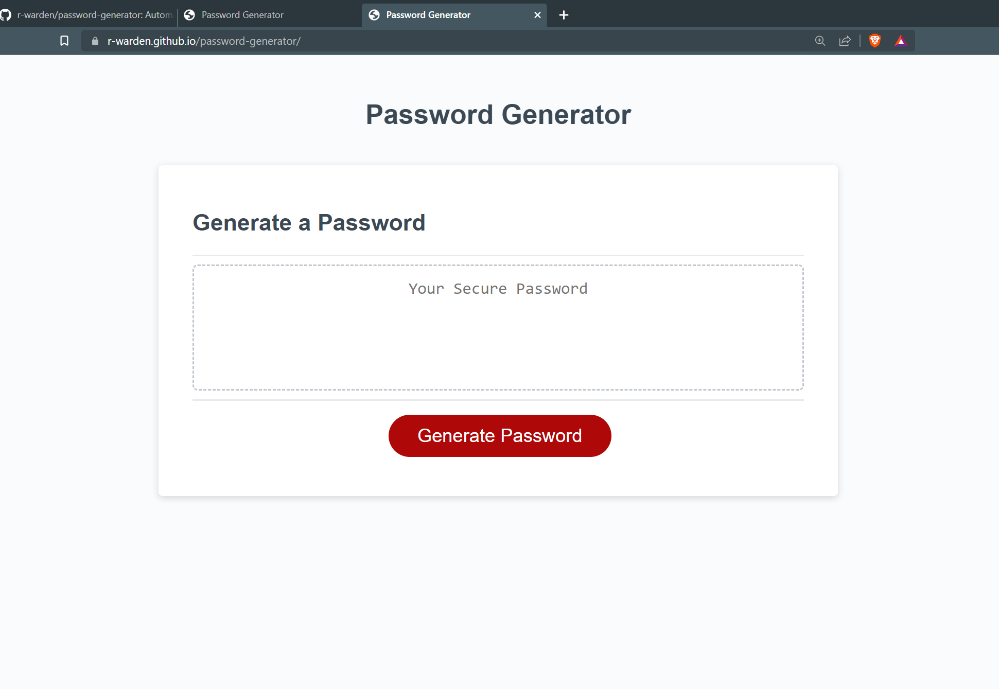

# Password Generator

## Description

Randomly generates a password based on user selected criteria.

## Table of Contents

- [Installation](#installation)
- [Usage](#usage)
- [Screenshots](#screenshots)
- [Credits](#credits)
- [License](#license)

## Installation

N/A

## Usage

To use this generator, click the "Generate Password" button. Answer the prompts that pop up, and then the password will be automatically generated and displayed. The deployed site can be viewed at https://r-warden.github.io/password-generator/

## Screenshots

## Credits

A line of code for generating a random string was found at https://www.slingacademy.com/article/ways-to-generate-random-strings-in-javascript/ as noted in the comments of the submitted files.

## License

Please refer to the license in the repository.
